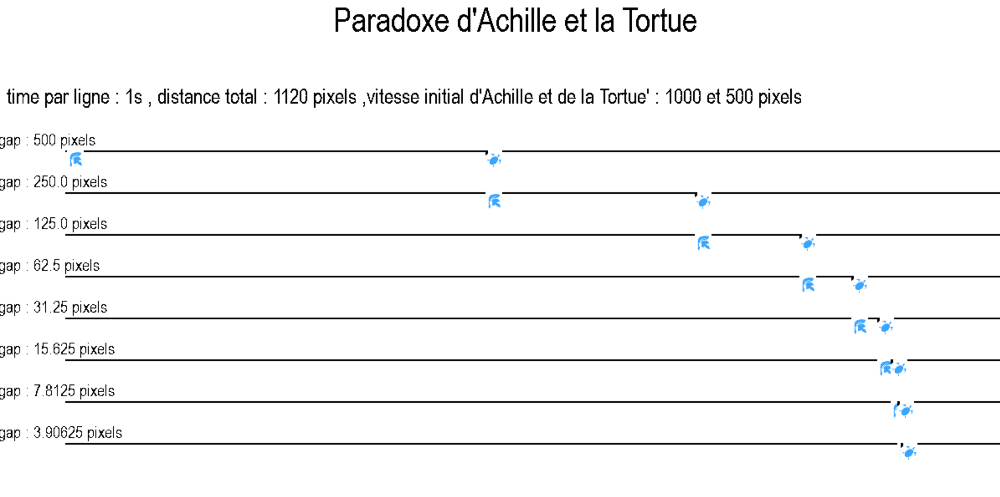
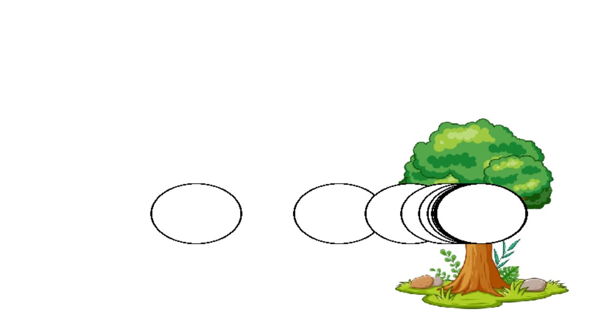
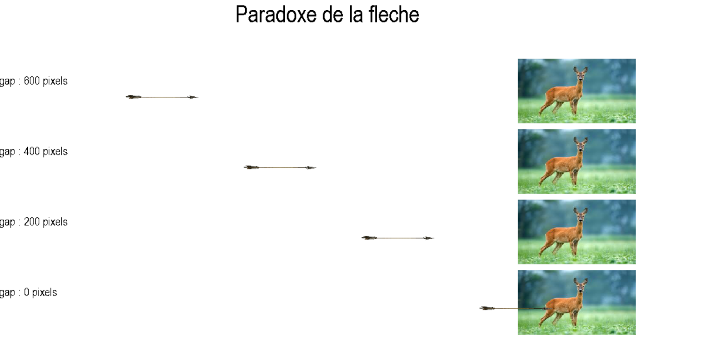

# Projet : zeno-paradoxes 

Temps : 1 semaine , équipe de 3 : Tadjidine , Ilyes et Ayoub

# Définitions de quelques mots : 
Paradoxe : Opinion qui va à l'encontre de l'opinion communément admise
python : Langage de programation
librairie : c'est un ensemble de fonctions, de classes d'objets et de constantes qui permettent de travailler sur un thème particulier

Nous avons étudié 3 paradoxes crée par zénon , un philosophes grec. Il nous etait demandé de coder ces paradoxes en python et de les représenter en affichage graphique avec la librairie pygame.

# 1 er paradoxe : 

Achille et la tortue : 

Dans ses réflexions, Zenon imagine Achille, le héros au pied léger, engagé dans une course à pied avec une humble tortue. Mais à l'étonnement de Zénon, la course se déroule de la manière la plus singulière qui soit. Alors qu'Achille donne à la tortue une longueur d'avance, il découvre bientôt que, quelle que soit la rapidité de son sprint, il ne parvient jamais à dépasser la créature pataude. En effet, à chaque fois qu'Achille atteint le point où se trouvait la Tortue, la créature a progressé davantage, lui échappant éternellement.

# 2 ème paradoxe : 

Le paradoxe de dichotomie :

Imaginez que Zénon se trouve face à un arbre imposant, tenant fermement une pierre dans sa main. Sa tentative de toucher l'arbre en lançant la pierre se heurte à un paradoxe intrigant. Selon sa réflexion, la pierre doit franchir la moitié de la distance totale de 8 mètres pour atteindre l'arbre, soit 4 mètres. Ensuite, celle-ci doit parcourir des distances réduites successives : deux mètres, un mètre, et ainsi de suite, chaque étape prenant un temps fini. Cette progression ininterrompue amène Zénon à une conclusion : la pierre ne peut jamais atteindre l'arbre. Il semblerait que pour ce faire, la
pierre doive accomplir une infinité d'étapes, ce qui, aux yeux de Zénon, défie toute logique.

# 3 ème paradoxe : 

Le paradoxe de la flèche : 

Dans le paradoxe de la flèche, Zénon imagine une flèche en vol. À chaque instant, la flèche occupe une position précise dans l'espace. Si l'instant est trop court, alors la flèche n'a pas le temps de se déplacer et reste au repos pendant cet instant.
Maintenant, pendant les instants suivants, elle va rester immobile pour la même raison. Si le temps est une succession d'instants et que chaque instant est un moment où le temps est arrêté, le temps n'existe donc pas. La flèche est donc toujours immobile à chaque instant et ne peut pas se déplacer : le mouvement est donc impossible.

